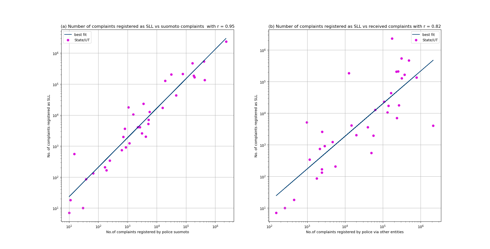

# DS200:Research Methods
* * *
## Module 4 : Assignment
* * *

> **AIM:- To download a dataset from www.data.gov.in and do the following**
>> Make a scatterplot, barchart and boxplot and draw inferences from it.

### Part1: - Dataset
> The dataset is **Crime in India - 2009/State/UT-wise Complaints received by Police & Cases registered under IPC & SLL during 2009** and is  downloaded from www.data.gov.in.
>> The link to download the dataset is https://data.gov.in/resources/stateut-wise-complaints-received-police-cases-registered-under-ipc-sll-during-2009 .  The data is uploaded by **National Crime Records Bureau- Ministry of Home Affairs** (http://ncrb.gov.in/)

### Part2: - Scatter Plot
> Below are two scatterplot.

1.  The plot on left has **Number of complaints registered suomoto by police** -i.e The cases registered by police on based on their investigation - vs **Number of complaints registered as SLL** (SLL:- Special and Local Laws, these are laws which are not part of IPC and include law instituted by Acts like Gambling act 1867, Forest Act 1927, etc) for 28 states (based on 2009 data) and 7 union territories of India.
2.  The plot on the right has **Number of complaints registered to police by oral,written or via helpline** vs **Number of cases registered as SLL**  for 28 states (based on 2009 data) and 7 union territories of India.
3. Both the **x-axis** and **y-axis** are on log10 scale. Best fit line is also plotted in each scatter plot.
#### The observations one can derive from the scatterplot are the following:-
1.  The number of complaints registered suomoto by the police for a state/UT are highly correlated with the number of complaints filed under SLL. 
2.  The correlation between number of complaints registered by others(not suomoto by police) are not correlated to the number of complaints filed under SLL to that extent.
3.  A logical reason for this is that mostly complaints under Special and Local Laws are filed againsts an entity after investigation by law enforcers and are therefore not filed on recieving of first complaint (with few exceptions like cognizible crime under Dowry Actor SC/ST attrocity ACT).
